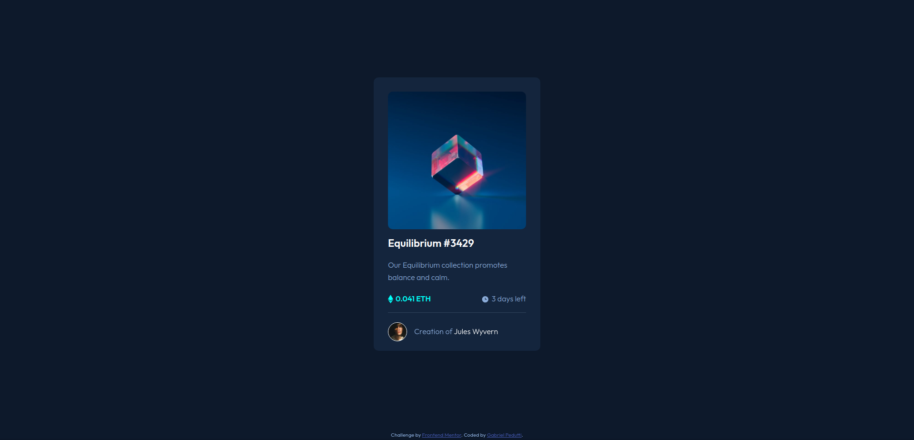

# Frontend Mentor - NFT preview card component solution

This is a solution to the [NFT preview card component challenge on Frontend Mentor](https://www.frontendmentor.io/challenges/nft-preview-card-component-SbdUL_w0U). Frontend Mentor challenges help you improve your coding skills by building realistic projects. 

## Table of contents

- [Overview](#overview)
  - [The challenge](#the-challenge)
  - [Screenshot](#screenshot)
  - [Links](#links)
- [My process](#my-process)
  - [Built with](#built-with)
  - [What I learned](#what-i-learned)
- [Author](#author)

**Note: Delete this note and update the table of contents based on what sections you keep.**

## Overview

### The challenge

Users should be able to:

- View the optimal layout depending on their device's screen size
- See hover states for interactive elements

### Screenshot

### Links

- Solution URL: [GitHub](https://github.com/gabrielpedutti/nft-preview-card-component-main)
- Live Site URL: [Live Site](https://gabrielpedutti.github.io/nft-preview-card-component-main/)

## My process

### Built with

- Semantic HTML5 markup
- CSS custom properties
- Flexbox
- Mobile-first workflow

### What I learned

This was my first project, where I took a template and tried to replicate it only with the images and fonts used available.
It was a big challenge, especially regarding the functionality when hovering over the image.
I did a lot of research to make it work and I believe that by keeping this focus I will learn more and more.

## Author

- Frontend Mentor - [@gabrielpedutti](https://www.frontendmentor.io/profile/gabrielpedutti)
- Linkedin - [Gabriel Pedutti](https://www.linkedin.com/in/gabriel-pedutti-9698b520b/)
- Twitter - [@gabrielpedutti](https://www.twitter.com/gabrielpedutti)

